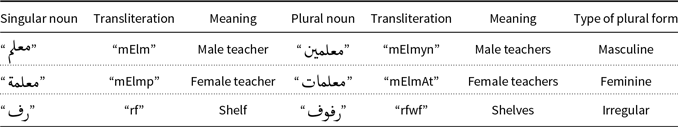
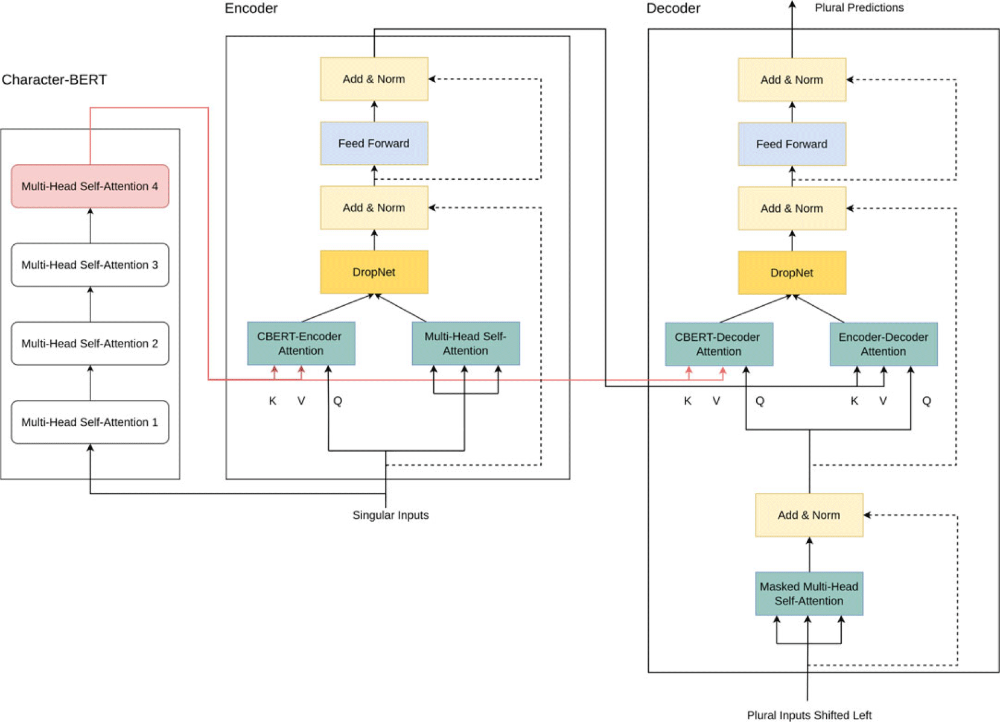
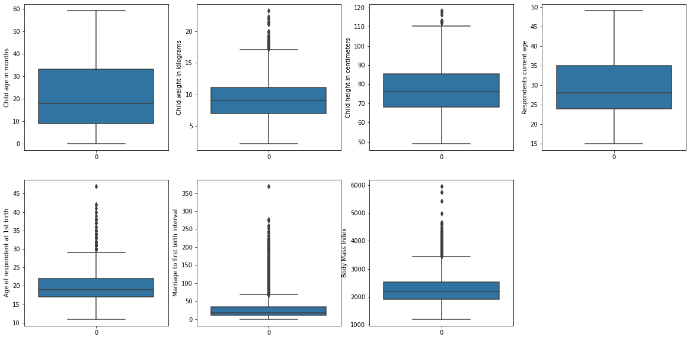
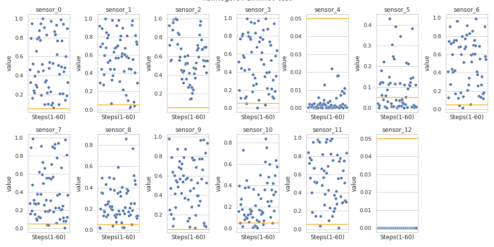

# Data Scientist

#### Technical Skills: SQL, Python, PowerBI, SPSS
- Data processing and handling: Pandas,  SQL, MS Excel
- Statistical analysis: Numpy, Scipy, Statsmodels
- Visualization: Seaborn, Matplotlib, Plotly, Power Bi
- Modeling: sikit-learn, Tensorflow, Keras, huggingface, transformers
- Version control: Git/ Github

## Education							       		
- M.S., Data Science	| Jordan University for Science and Technology (_November 2023_)	 			        		
- B.S., Electrical Power Engineering | Yarmouk University (_January 2019_)

## Work Experience (Before Master's Degree)
- STATISTICAL DATA AND QUALITY CONTROL ANALYST | Moore Yemen (_December 2019_ - _September 2020_)
- INFORMATION MANAGEMENT ASSISTANT | Direct Aid, Yemen  (_May 2019_ - _October 2019_)

  
## NLP Projects (Dureing Master's Studies)
  
### Neural Arabic singular-to-plural conversion using a pretrained Character-BERT and a fused transformer

[Publication](https://www.cambridge.org/core/journals/natural-language-engineering/article/neural-arabic-singulartoplural-conversion-using-a-pretrained-characterbert-and-a-fused-transformer/E181664F4CEDC19C02B073D9C582EB62?utm_campaign=shareaholic&utm_medium=copy_link&utm_source=bookmark)

Morphological re-inflection generation is one of the most challenging tasks in the natural language processing (NLP) domain, especially with morphologically rich, low-resource languages like Arabic.It is worth remarking that there are three forms of plural nouns in the Arabic language: masculine, feminine, and irregular. The first two of which are the easier to predict in terms of the morphological structure as they only need two additional suffixes to the end of the word to convert the singular form into plural, namely “”–“yn” or “”–“wn” and “”–“At” for the masculine, and feminine nouns, respectively. However, for the irregular form, the task is more challenging where internal changes are needed to generate plural forms.

We investigate the ability of transformer-based models in the singular-to-plural Arabic noun conversion task. We start with pretraining a Character-BERT model on a masked language modeling task using 1,134,950 Arabic words and then adopting the fusion technique to transfer the knowledge gained by the pretrained model to a full encoder–decoder transformer model, in one of the proposed settings. The second proposed setting directly fuses the output Character-BERT embeddings into the decoder. We then analyze and compare the performance of the two architectures and provide an interpretability section in which we track the features of attention with respect to the model. We perform the interpretation on both the macro and micro levels, providing some individual examples. Moreover, we provide a thorough error analysis showing the strengths and weaknesses of the proposed framework. To the best of our knowledge, this is the first effort in the Arabic NLP domain that adopts the development of an end-to-end fused-transformer deep learning model to address the problem of singular-to-plural conversion.

### Spans Detection of Toxic Phrases in Arabic Tweets

[Publication](https://ieeexplore.ieee.org/abstract/document/9811228)

The need for an automated toxicity detection system in Online Social Networks (OSN) is dramatically increasing as the content of abusive and hateful language in social networking communities is propagating. This inflation in toxic activities burdens human moderators and makes the task of filtering out such destructive contents harder. In this paper, we investigate and develop different techniques and deep learning models to detect the spans of characters within an Arabic content that drive a model to classify it as being toxic. Incorporating a model capable of providing such a detailed output into an automated toxicity detection system would significantly reduce the amount of time required to investigate measures taken by automated systems against contents classified as toxic.
  
## Projects (Dureing Master's Studies)
- Analysis of USAID DHS Data to Address Malnutrition in Yemeni Children

- Visual Analysis and Explainable Deep Learning Modelling of Human Activity Time Series Data

- G-Research Crypto Forecasting (Time-Series Analysis)

- Santander customer data analysis
- 
## Publications

- Radman, Azzam, Mohammed Atros, and Rehab Duwairi. "Neural Arabic singular-to-plural conversion using a pretrained Character-BERT and a fused transformer." Natural Language Engineering (2023): 1-25.‏
- Radman, Azzam, Mohammed Atros, and Rehab Duwairi. "Spans Detection of Toxic Phrases in Arabic Tweets." 2022 13th International Conference on Information and Communication Systems (ICICS). IEEE, 2022.‏
